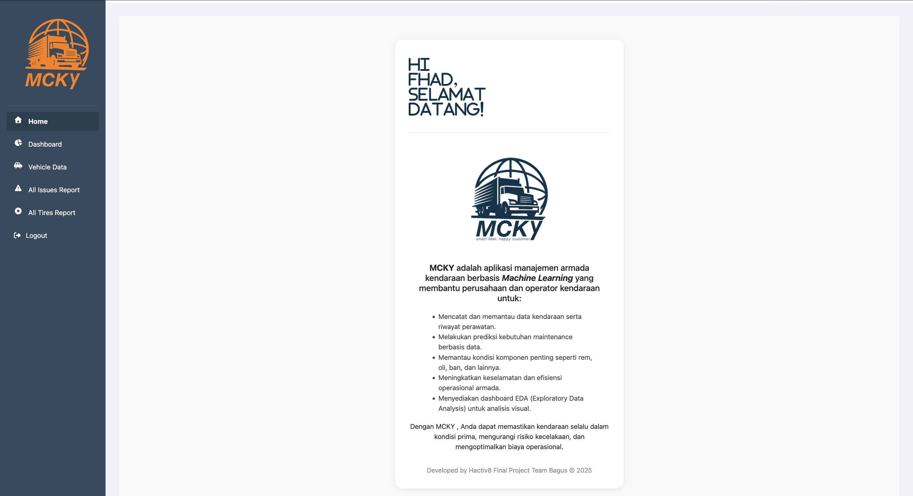
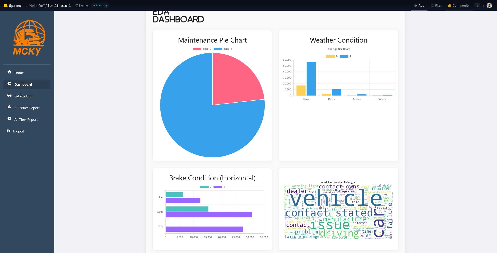

# MCKY – Maintenance Check and Safety for Fleet

> Predictive maintenance system to monitor fleet health, detect potential issues, and provide actionable insights for logistics companies.

---

## Repository Outline

1. **README.md** – Project overview & documentation.  
2. **notebooks/** – Jupyter Notebooks containing the complete ML pipeline: data loading, cleaning, EDA, feature engineering, regression modeling, NLP, computer vision, evaluation.  
3. **data/** – Raw and processed fleet datasets (engine sensors, operational data, user feedback).  
4. **models/** – Saved machine learning models:  
   - `regression_model.pkl` – Predictive maintenance (engine/operational data).  
   - `nlp_model.pkl` – Complaint text classification.  
   - `cv_model.pkl` – Image-based vehicle condition classification.  
5. **deployment/**  
   - `preprocessing_pipeline.pkl` – Data preprocessing pipeline.  
   - `streamlit_app.py` – Frontend deployment (Streamlit/Hugging Face).  
   - `eda_app.py` – EDA & visualization app.  
6. **images/** – Diagrams, flowcharts, dashboard screenshots.  

---

## Problem Background

Fleet management in logistics companies faces high operational costs due to unexpected vehicle breakdowns and inefficient maintenance scheduling.  
By combining engine sensor data, operational load information, and user feedback, predictive models can anticipate potential failures, reduce downtime, and improve overall fleet safety.

---

## Project Output

- **Predictive Maintenance Model (Regression):** Classifies vehicle condition → Good / Needs Investigation / Needs Maintenance.  
- **NLP Model:** Processes user complaints (text) to identify potential mechanical issues.  
- **Computer Vision Model:** Classifies image-based input (vehicle/battery/engine condition) from users.  
- **Dashboard:** Provides alerts and recommendations (go to mechanic or update status).  
- **Deployed Web App:** Interactive prediction and EDA hosted on [Hugging Face](https://huggingface.co/spaces/HelasOn7/fe-finpro).  

---

## Data

- **Source**: Logistics Vehicle Maintenance Dataset (Kaggle) & simulated user complaint/image data.  
- **Features**:  
  - **Engine/Sensor Data (Div. Armada):** Engine temperature, tire pressure, usage hours, vibration levels, battery status, vehicle info.  
  - **Operational Data (Div. Operasional):** Actual load, route info, historical maintenance, last maintenance date.  
  - **User Feedback:** Complaint texts, uploaded images.  
- **Target:** Maintenance status → Good / Investigate / Maintenance required.  

---

## Method

- **Regression Models** – Predict vehicle condition based on numerical and categorical features.  
- **NLP Models** – Text classification for complaint data.  
- **Computer Vision Models** – Image classification for physical damage/condition reports.  
- **Dashboard Integration** – Centralized platform showing alerts and recommended actions.  
- **Evaluation Metrics** – Accuracy, Precision, Recall, F1-score for classification tasks; RMSE/R² for regression tasks.  

---

## System Flow

**Steps:**  
1. Div. Armada provides engine sensor data.  
2. Div. Operasional provides load, route, and historical maintenance data.  
3. Predictive regression model assesses vehicle condition.  
4. Dashboard generates alerts.  
5. If “Investigation” → NLP (complaint text) & CV (image data).  
6. If “Maintenance” → send vehicle to workshop.  
7. If “Good” → update status and continue operation.  

---

## Stacks

- **Python 3.x**  
- Jupyter Notebook  
- Pandas, NumPy  
- Scikit-learn, XGBoost, LightGBM  
- TensorFlow / PyTorch (for NLP & CV)  
- Matplotlib, Seaborn, Plotly  
- Streamlit (deployment)  
- Hugging Face Spaces (app hosting)  

---

## Reference

- Kaggle: Logistics Vehicle Maintenance Dataset  
- Hacktiv8 Machine Learning & Deployment Materials  
- Automotive & logistics maintenance case studies  

---

## Additional References

- [Hugging Face App – MCKY](https://huggingface.co/spaces/HelasOn7/fe-finpro)  
- [Google Colab Hacktiv8 ML Problem Framing](https://colab.research.google.com/github/FTDS-learning-materials/phase-1/blob/v2.3/w1/P1W1D1PM%20-%20Machine%20Learning%20Problem%20Framing%20-%20Training.ipynb)  

 

---

## Contact

For questions or collaboration:  
**Hafiz Alfariz** – [LinkedIn](https://www.linkedin.com/in/hafizalfariz/) | [GitHub](https://github.com/hafizalfariz)
